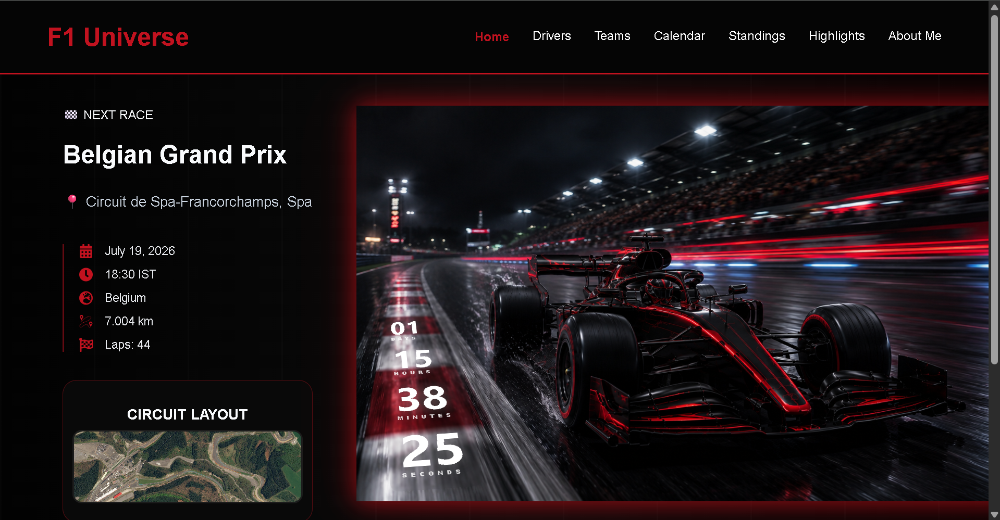
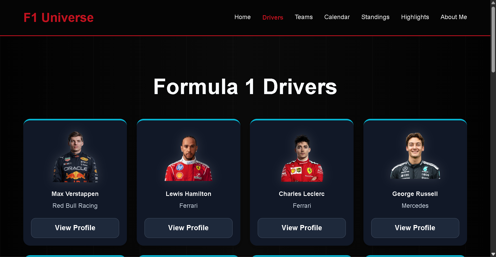
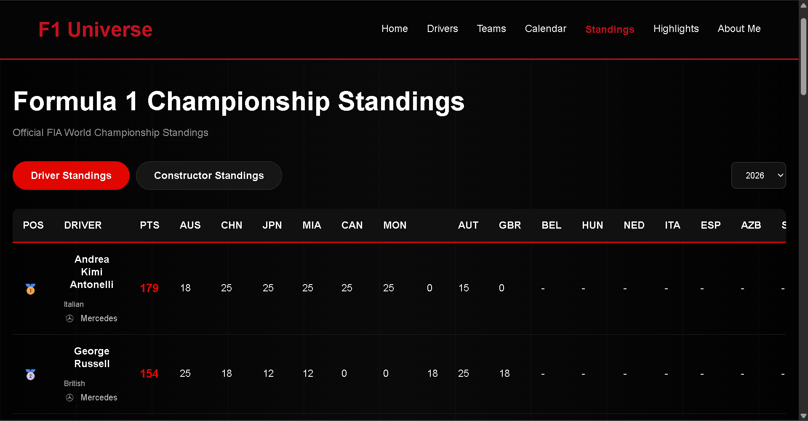
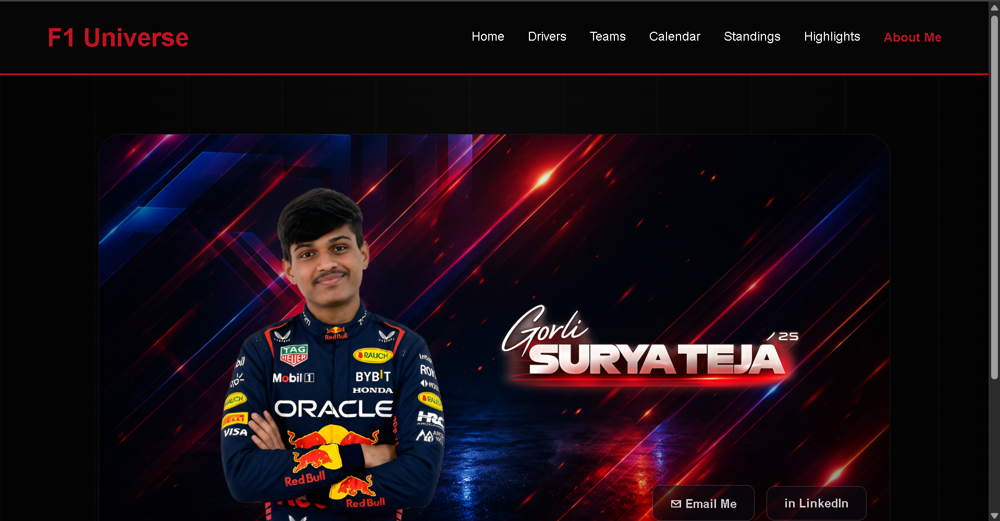

# F1 Universe – Formula 1 Information & Analytics Platform

A modern Formula 1 information and analytics platform designed to provide race schedules, driver and constructor information, championship standings, circuit details, race highlights, and dynamic race data in one place.

---

## 🌐 Live Demo

You can view the deployed project here: **Coming Soon**

## 📌 Overview

F1 Universe is a Formula 1-focused web application that brings essential racing information into a single interactive platform.

The application combines dynamic Formula 1 data from external APIs with locally maintained circuit and driver assets to provide an engaging and responsive user experience.

The project demonstrates practical implementation of React-based frontend development, REST API integration, dynamic data rendering, client-side routing, caching, and responsive UI design.

---

## ⚙️ Core Features

- 🏎️ Formula 1 driver profiles
- 🏁 Formula 1 team and constructor profiles
- 📅 Dynamic race calendar
- ⏱️ Next race information with live countdown
- 🏆 Driver Championship standings
- 🏆 Constructor Championship standings
- 📊 Driver and team career statistics
- 🗺️ Circuit information and layouts
- 🎬 Race highlights section
- 📆 Season-based Formula 1 data
- ⚡ API response caching for improved performance
- 📱 Responsive user interface
- 👤 Dedicated creator profile page

---

## 🔌 API Integration

The application integrates Formula 1 data through the Jolpica F1 API, which provides Ergast-compatible motorsport data.

Dynamic data includes:

- Race schedules
- Driver standings
- Constructor standings
- Race results
- Driver statistics
- Constructor statistics

Static circuit information such as circuit length, number of laps, and circuit images is maintained locally where appropriate.

---

## 🛠️ Tech Stack

- React.js
- JavaScript
- HTML5
- CSS3
- React Router
- React Icons
- REST API Integration
- Jolpica F1 API
- Vite
- Git & GitHub

---

## 📸 Screenshots

### Homepage

### Driver Profile

### Championship Standings

### About the Creator

---

## 🎯 Project Objective

To design and develop a modern Formula 1 information and analytics platform that brings together driver information, team details, race schedules, championship standings, and race highlights in a single interactive web application.

The project demonstrates API integration, dynamic data rendering, responsive frontend development, and structured React component architecture.

---

## 👨‍💻 Developer

**Surya Teja Gorli**  
B.Tech Computer Science and Engineering (AI-ML)  
SRM Institute of Science and Technology

GitHub: https://github.com/suryatejagorli  
LinkedIn: https://linkedin.com/in/suryatejagorli

---

## ©️ Copyright

© 2026 Surya Teja Gorli. All rights reserved.

This project and its original source code are the intellectual property of Surya Teja Gorli. Unauthorized copying, modification, distribution, or reuse of the original project code is not permitted.
